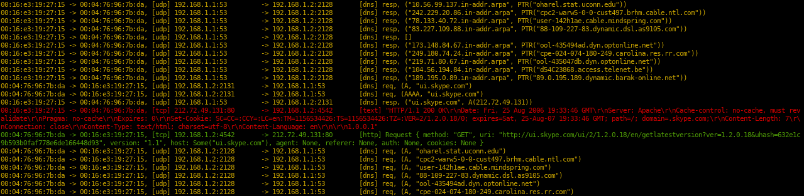

# sniffglue [![Build Status][travis-img]][travis] [![Crates.io][crates-img]][crates]

[travis-img]:   https://travis-ci.org/kpcyrd/sniffglue.svg?branch=master
[travis]:       https://travis-ci.org/kpcyrd/sniffglue
[crates-img]:   https://img.shields.io/crates/v/sniffglue.svg
[crates]:       https://crates.io/crates/sniffglue

sniffglue is a network sniffer written in rust. Network packets are parsed concurrently
using a thread pool to utilize all cpu cores. Project goals are that you can
run sniffglue securely on untrusted networks and that it must not crash
when processing packets. The output should be as useful as possible by default.

## Usage

    # sniff with default filters (dhcp, dns, tls, http)
    sniffglue enp0s25
    # increase the filter sensitivity (arp)
    sniffglue -v enp0s25
    # increase the filter sensitivity (cjdns, ssdp, dropbox, packets with valid utf8)
    sniffglue -vv enp0s25
    # almost everything
    sniffglue -vvv enp0s25
    # everything
    sniffglue -vvvv enp0s25

## Installation

### Arch Linux

    pacman -S sniffglue

### Mac OSX

    brew install sniffglue

### Debian/Ubuntu/Kali

There are prebuilt packages signed by a debian maintainer. We can import the
key for this repository out of the debian keyring.

    apt install debian-keyring
    gpg -a --export --keyring /usr/share/keyrings/debian-maintainers.gpg git@rxv.cc | apt-key add -
    apt-key adv --keyserver keyserver.ubuntu.com --refresh-keys git@rxv.cc
    echo deb http://apt.vulns.sexy stable main > /etc/apt/sources.list.d/apt-vulns-sexy.list
    apt update
    apt install sniffglue
    
### Alpine

    apk add sniffglue

### Gentoo

    layman -a pentoo
    emerge --ask net-analyzer/sniffglue

### NixOS

    nix-env -i sniffglue

### From source

To build from source make sure you have libpcap and libseccomp installed. On
debian based systems:

    # install the dependencies
    sudo apt install libpcap-dev libseccomp-dev
    # install rust with rustup
    curl --proto '=https' --tlsv1.2 -sSf https://sh.rustup.rs | sh
    source $HOME/.cargo/env
    # install sniffglue and test it
    cargo install sniffglue
    sniffglue --help

Or you can build a Debian package via [cargo-deb](https://github.com/mmstick/cargo-deb):

    cargo deb

## Protocols

- [X] ethernet
- [X] ipv4
- [X] ipv6
- [X] arp
- [X] tcp
- [X] udp
- [X] icmp
- [X] http
- [X] tls
- [X] dns
- [X] dhcp
- [X] cjdns eth beacons
- [X] ssdp
- [X] dropbox beacons
- [X] ppp
- [ ] 802.11

## Docker

You can build sniffglue as a docker image to debug container setups. The image
is currently about 11.1MB. It is recommended to push it to your own registry.

    docker build -t sniffglue .
    docker run -it --init --rm --net=host sniffglue eth0

## Security

To report a security issue please contact kpcyrd on ircs://irc.hackint.org.

### Seccomp

To ensure a compromised process doesn't compromise the system, sniffglue uses
seccomp to restrict the syscalls that can be used after the process started.
This is done in two stages, first at the very beginning (directly after
env\_logger initialized) and once after the sniffer has been setup, but before
packets are read from the network.

### Hardening

During the second stage, there's also some general hardening that is applied
before all unneeded syscalls are finally disabled. Those are system specific,
so a configuration file is read from `/etc/sniffglue.conf`. This config
file specifies an empty directory for `chroot` and an unprivileged account
in `user` that is used to drop root privileges.

### boxxy-rs

This project includes a small [boxxy-rs] based shell that can be used to
explore the sandbox at various stages during and after initialization. This is
also used by travis to ensure the sandbox actually blocks syscalls.

    cargo run --example boxxy

[boxxy-rs]: https://github.com/kpcyrd/boxxy-rs

### Reproducible builds

This project is tested using reprotest. Currently the following variations are
excluded:

- `-time` - needed because the crates.io cert expires in the future
- `-domain_host` - requires root for unshare(2) and has been excluded

Don't forget to install the build dependencies.

    ci/reprotest.sh

### Fuzzing

The packet processing of sniffglue can be fuzzed using [cargo-fuzz].
Everything you should need is provided in the `fuzz/` directory that is
distributed along with its source code. Please note that this program links
to libpcap which is not included in the current fuzzing configuration.

    cargo fuzz run read_packet

[cargo-fuzz]: https://github.com/rust-fuzz/cargo-fuzz

## License

GPLv3+
